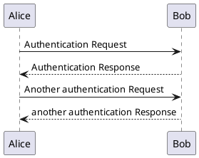
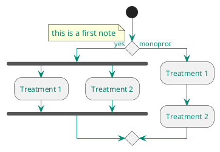

### Section X

```plantuml
@startuml
Alice -> Bob: Authentication Request
Bob --> Alice: Authentication Response

Alice -> Bob: Another authentication Request
Alice <-- Bob: another authentication Response
@enduml
```

```plantuml
@startuml
skinparam monochrome false
skinparam DefaultFontColor #008770
skinparam ArrowColor #008770
skinparam DefaultBorderColor #008770
start

if () then (yes)
  fork
	:Treatment 1;
  fork again
	:Treatment 2;
  end fork
else (monoproc)
  note left: this is a first note
  :Treatment 1;
  :Treatment 2;
endif

@enduml
```
